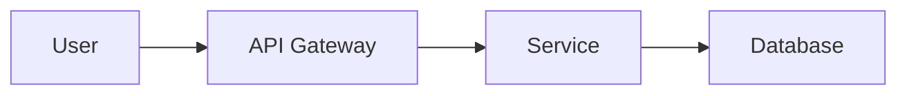

# Contributing to AI Infrastructure Demos

Thank you for your interest in contributing to this portfolio! This repository demonstrates production-grade infrastructure patterns, and while it's primarily a showcase, I welcome collaboration and feedback.

## 🎯 What This Repository Is

This is a **portfolio/demo repository** showcasing:
- Production-ready infrastructure code
- Architectural patterns for AI/ML systems
- Kubernetes deployment implementations
- Multi-agent AI systems
- Security & supply chain practices

## 🤝 How to Contribute

### Reporting Issues

If you find a bug, have a suggestion, or want to discuss a topic:
- [Create an issue](https://github.com/awdemos/demos/issues)
- Provide detailed reproduction steps (for bugs)
- Share your use case (for suggestions)
- Be respectful and constructive

### Suggesting Improvements

I'm always interested in:
- Better architectural patterns
- Security hardening approaches
- Performance optimizations
- Alternative implementation approaches
- Documentation improvements

### Discussion & Questions

This repository is a learning resource. Feel free to:
- Ask questions about implementation details
- Request clarification on architectural decisions
- Discuss alternative approaches
- Share your own experiences with similar challenges

## 📝 Code Style & Standards

### General Principles

- **Follow existing patterns** - Each demo has its own conventions
- **Document your changes** - Update READMEs, comments, and diagrams
- **Test thoroughly** - Ensure your changes don't break existing functionality
- **Be specific** - Clear commit messages and issue descriptions

### Infrastructure as Code

- **Terraform/Pulumi**: Follow existing module structure
- **Kubernetes manifests**: Use Helm where appropriate, keep manifests declarative
- **Dockerfiles**: Multi-stage builds, minimal base images, clear layer caching

### Development Practices

- **Python**: Follow PEP 8, use type hints, include docstrings
- **Go**: Follow Go standard conventions
- **Rust**: Use `cargo fmt` and `cargo clippy`
- **Shell**: POSIX-compliant where possible, use shellcheck

## 🧪 Testing

### Before Submitting Changes

1. **Test locally**: Ensure your changes work as expected
2. **Check formatting**: Run linters/formatters for the language
3. **Update documentation**: READMEs, diagrams, and comments
4. **Verify demos**: Ensure related demos still work

### Continuous Integration

This repository uses GitHub Actions for:
- Build verification
- Linting and formatting checks
- Security scanning

Make sure all CI checks pass before submitting PRs.

## 📖 Documentation

### What Should Be Documented

- **Architecture**: System design, component interactions
- **Quick Start**: How to run the demo
- **Configuration**: Required and optional parameters
- **Troubleshooting**: Common issues and solutions

### Diagrams

Use **Mermaid** for architecture diagrams:

## 🔒 Security

### Reporting Vulnerabilities

If you discover a security vulnerability:
- **Do NOT open a public issue**
- Create a private GitHub issue with "Security:" prefix
- Include reproduction steps and impact assessment
- Allow 90 days for remediation before disclosure

### Best Practices

- Keep dependencies updated
- Use signed commits (GPG)
- Follow principle of least privilege
- Never commit secrets or credentials

## 🎨 Visual Assets

### Screenshots & Demos

- Show the demo in action
- Include terminal output where relevant
- Highlight key features
- Use high-contrast colors for readability

### GIFs

For interactive demos:
- Keep them short (< 15 seconds)
- Show end-to-end workflow
- Include text captions for steps
- Optimize file size (< 5MB)

## 📄 License

By contributing, you agree that your contributions will be licensed under the **MIT License**.

## 🚀 Getting Started

### Quick Start

1. Fork this repository
2. Create a feature branch (`git checkout -b feature/amazing-feature`)
3. Make your changes
4. Commit with clear messages (`git commit -m "Add: feature description"`)
5. Push to your fork (`git push origin feature/amazing-feature`)
6. Open a pull request

### Pull Request Guidelines

- **Small, focused changes** are easier to review
- **Reference related issues** in your PR description
- **Explain your approach** and why it's better
- **Include screenshots** for UI/UX changes
- **Update tests** if applicable

## 💬 Code of Conduct

Be respectful, constructive, and inclusive. We're all learning together.

- Respect differing viewpoints
- Focus on what's best for the community
- Show empathy toward other community members
- Gracefully accept constructive criticism

## 🙏 Recognition

Contributors will be acknowledged in:
- Project README (for significant contributions)
- Release notes
- Individual demo acknowledgments

---

## 📞 Contact

Have questions? Open an issue or:
- 📧 Create a GitHub issue
- 🐙 Star interesting demos to show support

Thank you for contributing to open source! 🎉
