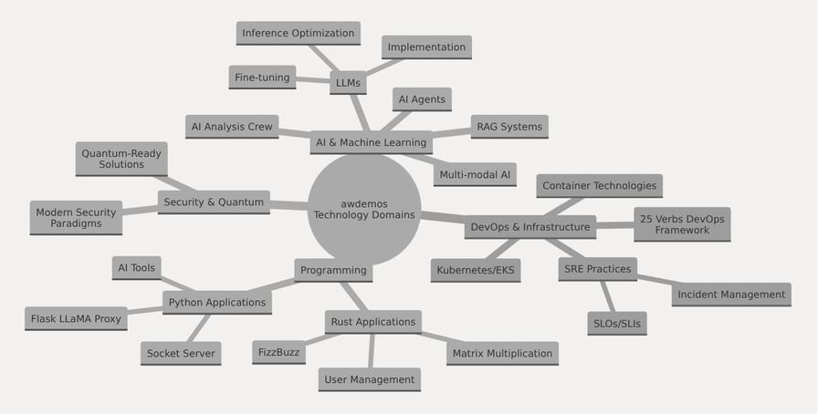
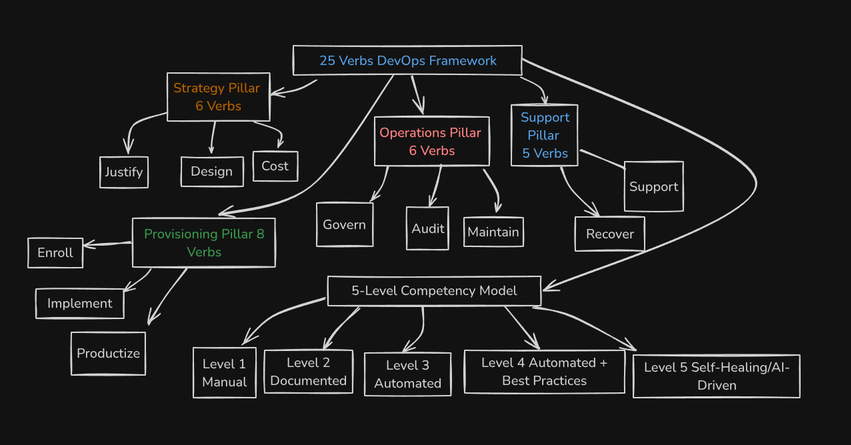

## My Demos Repo: showcasing my skills for AI, DevOps, Robotics, and Quantum Computing solutions.


Welcome to my demos repository—a curated showcase of innovative software projects at the crossroads of AI, DevOps, and advanced cloud technologies. These projects reflect years of research, hands-on development, and a commitment to excellence in shaping the future of software delivery. While this collection represents only a fraction of my work, it offers a glimpse into the high-quality solutions I create to tackle complex challenges. If you're exploring this repository, you're already ahead of the curve in embracing next-generation engineering practices. Please share with anyone who would like it!

### Recognitions

<div style="display: flex; align-items: center; gap: 20px;">
  
  
</div>

## Repository Mind Map

The repository encompasses four primary technology domains, each containing multiple sub-areas of expertise: DevOps & Infrastructure, AI & Machine Learning, Security & Quantum Computing, Programming.




## Key Projects and Demonstrations
The repository contains several featured projects that demonstrate practical applications of various technologies:

| Project                  | Description                                         | Domain         | Technologies                |
|--------------------------|-----------------------------------------------------|----------------|-----------------------------|
| AI Analysis Crew         | System using LLMs for research and content creation | AI/ML          | LLMs, RAG, Agents           |
| Multimodal Benchmarks    | Evaluation framework for multimodal AI models       | AI/ML          | Multimodal AI, Metrics      |
| User Management System   | Rust-based user management with PostgreSQL          | Rust           | Rust, Databases             |
| Matrix Multiplication    | High-performance matrix operations library          | Rust           | Rust, ndarray               |
| Flask LLaMA Proxy        | Flask application for proxying LLaMA model requests | Python         | Flask, LLMs                 |
| Kubernetes/EKS Demos     | K8s deployment examples with AI components          | Infrastructure | Kubernetes, Containers      |
| SRE Practices            | SLO/SLI implementations and incident management     | Infrastructure | Monitoring, Alerting        |
| Quantum-Ready Security   | Security implementations for post-quantum era       | Security       | Post-Quantum Cryptography   |

## The 25 Verbs DevOps Framework
A significant component of the repository is the [25 Verbs DevOps Framework](docs/25_Verbs_Devops.md), a comprehensive methodology for implementing and assessing DevOps practices.



I have a modified version of this ready to go for AIOps.

## Why Choose Me as Your AI/DevOps/ML Lead?

Are you navigating the complex changes involved with AI, platform engineering, and DevOps ? I specialize in emerging technology and I have worked with advanced AI chatbots since 2016 and I have worked at software companies for over twenty years. I have seen a lot of good and a lot of bad engineering strategies 
over the years and have worked at many of the worlds leading startup companies, some of which are household names with billions of active users, and some of them are startups you have never heard of. In recent years I have been supporting enteprise-sized AI Center of Excellence at a Fortune 1000 company. I hear a lot about what companies large and small are doing with AI and I am confidant I know how to guide an organization on how to achieve successful outcomes in AI, DevOps, and Platform Engineering solutions. So lets deep dive into some detail about what that entails and why I'm your ideal partner in this journey:

### Expertise That Drives Innovation

- **AI/ML Mastery**: From LLMs, RAG to AI agents, and complex multi-modal AI platforms, I bring state of the art solutions to life, transforming theoretical concepts into practical, business-driving tools. 
- **Infrastructure Scaling Wizard**: I don't just manage growth; I architect for it. My owner's mentality ensures your infrastructure evolves as rapidly as your ambitions. I work hard on how to prevent problems occuring in the future through honest assessments of data and customer requirements.
- **Cloud & Kubernetes Veteran**: I know how to seamlessly integrate AI with software development workflows in CI and CD and the desktop and through APIs, also within cloud infrastructure in AWS, GCP, and Azure, and in various versions of Kubernetes with service meshes, policy controllers, and implement DevSecOps on day one. I aim to create robust, scalable environments that stand the test of time and traffic and I often take the lead on securing Kubernetes clusters, including some for publically traded companies with strict compliance and security auditing requirements.
- **Simple and elegant solutions delivery**: You may notice I give strong preference to open source tooling, simple standards like Markdown, command line tools and reproducability.

### LLM Implementation Specialist

- **Custom LLM Solutions**: Proficient in fine-tuning, deployment, and optimization of Large Language Models tailored to your unique business needs.
- **Multi-LLM Architecture**: Proficient in designing and implementing systems that leverage multiple LLMs for enhanced performance and versatility.
- **Agentic Frameworks**: I am well versed on all the offerings of agentic and multi-agent systems. 
- **Finetuning**: 
- **Inference Optimization**: I know how to utilize Unsloth for 2x inference benefits and I know a lot about additional resources on reducing inference costs.
- **LLM Security**: Trained in LLM red-teaming and aware of attacking stratigies on models and how to utilize Guardrails.

### Security-First Approach

- **Deep Understanding of Security Practices:** I specialize in Linux, container, and memory safe programming, virtually eliminating certain classes of vulnerabilities.
- **Quantum-Ready Solutions**: Getting prepared for the post-quantum era with advanced cryptography implementations and Q-Day readiness strategies.
- **Modern Security Paradigms**: Implementing security measures that address today's threats and tomorrow's challenges, moving beyond outdated cybersecurity notions. Cybersecurity pre-AI and LLM era is inadequate.

### Holistic Problem Solving

- **Full-Stack AI Integration**: From backend infrastructure to frontend applications, I ensure AI technologies are effectively woven into every layer of your tech stack.
- **Business Process Optimization**: I know how to leverage AI/ML to streamline operations, enhance decision-making, and drive efficiency for teams and organizations.

### Proven Track Record

- **Production-Grade Deployments**: Experience in delivering robust, scalable AI solutions. I have been supporting advanced commerical AI chatbot applications on-premise and in the cloud since 2016.
- **Innovative Problem-Solver**: I have a history of tackling complex challenges and producing reliable and production ready solutions backed by data and and years of following security, governance, and compliance for companies in regulated industries.
- **Award Winning Work**: In January of 2025 my team won an award for a prize by the US Navy.

### Customer Focused Approach

- **Customer Success is my success**: I care about my customers success as critical to my own. 
- **Trusted Adviusor**: I am confortable with NDAs and am ethical in my dealings.
- **Agile Methodology Expert**: I am comfortable with Agile practices or a more relaxed work style. Tell me how you like to work and I'll be accomodate to your style and expectations.
- **Clear Communication**: I pride myself on the ability to communicate with people with no technical background. I have 80 year old relatives who I have taught about AI. I keep the use of jargon only when in team appropriate meetings.
- **No time wasted**: I won't waste your time with promises I can't deliver on or drag out engagements for billable hours.

By choosing me, you're not just getting a subject matter expert in multiple domains; you're gaining a partner committed to elevating your engineering culture with a spirit of deep collaboration and meaningful deliverables. Let's transform your challenges into opportunities and set new benchmarks in what we can do!

## What I Offer

- **DevOps Strategy and Implementation**: Tailored bleeding-edge CICD solutions for the fastest builds possible, with zero Nday vulnerabilities, secure out of the box. If your builds take over a minute I can help you.
- **AI Strategy and Implementation**: Tailored AI solutions, from conceptualization to deployment. I have been working with advanced AI chatbots since 2016 and I have worked for influential figures in the AI industry.
- **Multi-Agent System Development**: Design and implementation of sophisticated multi-agent AI architectures. I am up to date on the latest techniques of this fascinating technology.
- **LLM Expertise**: Fine-tuning, deployment, and optimization of large language models. I know how to build LLMs from scratch and I have atteneded 3 bootcamps on this topic since 2024 and I am Nvidia certified.
- **Cloud-AI Integration**: Seamless integration of AI solutions with cloud and Kubernetes environments. I am comfortable with all the major cloud providers. My last work in the cloud was an Azure Copilot Studio project.
- **AI Performance Optimization**: Enhancing the efficiency and cost-effectiveness of AI deployments.
- **AI Product Strategy**: Strategic advice on AI product development and talent evaluation. I know all the trends, leading figures, topics of importants, and history of the AI field going back for decades. I am writing a book on these topics.
- **Technical Content Creation**: Comprehensive documentation and knowledge transfer for AI systems.
- **Briefed by leading AI vendors**: I attend briefings by Google, Dell, Apple, HPE, Nvidia, and many others where they tell me about their product updates before they are announced.
- **Huge professional network**: I have numerous friends and colleagues in the industry that has similar or has better skills then me in some areas.

## Consulting Services

### Tier 1: AI Strategy and Planning

- AI readiness assessments. In the discovery phase of getting to know you, you can ask me for a self-assessment survey of how your organizations AI readiness and AI maturity. I have been trained by Nvidia, Dell, Apple, and Google on how to assess if an organization can go from no readiness to a fully-managed and staffed AI Center of Excellence fulfilling the organizations AI goals.
- LLM implementation strategies. I am up to date on the latest models from all the major model providers like OpenAI, DeepSeek, Anthropic, Huggingface, Nvidia, Microsoft, Google, and others. I know of a lot of speciality models with unique capabilites and I make my own sometimes.
- Multi-agent system architecture design. There is a lot of ways to do this and I don't think there is any clear winner int he open-source world but a lot of the major projects are very appealling such as Crewai, etc.
- AI-driven product strategy. AI is great but without a product driven implementation plan expectations can be missed.
- Industry trend analysis and AI workshops
- Advanced AI techniques consultation (e.g., prompt engineering, zero-shot learning), private AI deployments.

### Tier 2: Comprehensive AI Implementation

Includes all Tier 1 services, plus:
- **Hands-on AI Development**: Production-ready AI code and prototypes.
- **MLOps Optimization**: Direct involvement in AI model fine-tuning and deployment.
- **AI Content Production**: Creation of technical AI documentation and thought leadership content.
- **Team AI Upskilling**: Personalized AI and ML training for your team members.
- **Ongoing AI Consultation**: Available on retainer for continuous AI guidance and problem-solving.

Tier 2 services are offered exclusively to ensure dedicated, high-quality support for your AI initiatives.

### My Demos Repo Highlights

- **AI & Machine Learning**: Innovative applications of LLMs and neural networks for real-world problem-solving.
- **DevOps Revolution**: Kubernetes-native AI orchestration and hybrid cloud/on-prem LLM deployments.
- **Quantum-Ready Solutions**: Q-day is a big deal and no one should take it for granted in the AI era that classic Internet cryptography standards might be broken soon or already are.
- **Emerging Tech Fusion**: Unique integrations of robotics, Rust, and advanced Linux scripting for next-gen applications.
- **Programming Language Experiments**: I experiment with a half dozen or so programming languages in this repo and you will 
see a lot of Bash, Python, Rust, Typescript, Go, I think there is dotnet in here, Lua.

### Featured Projects

1. **AI-Driven DevOps Pipeline**: Leveraging machine learning for predictive analytics and anomaly detection in CI/CD processes.
2. **Quantum-Resistant Cryptography Framework**: Proactive security measures against future quantum threats.
3. **Rust-Powered Cloud Native Tools**: High-performance, memory-safe utilities for modern cloud environments.
4. **Robotics AI Integration**: Cutting-edge algorithms for autonomous decision-making in robotic systems.

This repository is not just a code archive; it's an example on how to demonstrate continuous learning and innovation in software engineering. 
In some cases I hope shows my ability to tackle complex, future-facing challenges and deliver production-grade solutions across multiple domains challenging companies today.

I also have a lot of open source contributions and I enjoy working on open source projects in my free time. 


## Expertise Highlights

- **Emotional Intelligence and Conflict Resolution**: I base all my interactions at work according to the principles of Emotional Intelligence and Conflict Resolution. I pursue training in cultivating
body and emotional awareness, empathy to others, the development of active listening skills, and positive outcomes for all the stakeholders and contributors in a work environment.
- **Engineering Culture Specialist**: I contribute toward building a happy and rewarding engineering culture wherever I can. 
acheiving goals an organization may have. My interests closely track what you can find on HackerNews and I was strongly influenced on the hacker mindset early in my career on Slashdot.
- **AI and ML Consulting**: Specializing in cutting-edge AI solutions, including large language models (LLMs), multi-agent systems, and custom AI agent development for clients.
- **Cloud and On-premise Infrastructure**: I am experinced in deploying complex software applications and resources across public clouds using everything from Ansible, Terraform, and Pulumi.
I have managed racks of servers, server rooms, co-location in data centers, and cloud-native applications since the early 2000s. I stay current on the latest industry news on a daily basis.
- **Advanced Container and Docker security expertise**: I am deeply acquainted with container internals and best practices for secure and performant microservices. My favorite resource for advanced container
learnings right now is [iximiuz.com](https://iximiuz.com/en/)
- **Advanced AI Implementations**: Experience with agent build-out, multi-agent systems, and innovative AI architectures. I recently completed 6 months of AI bootcamp training from Stanford, Duke, and others.
- **DevOps and SRE**: Implementing best practices in Site Reliability Engineering and DevOps methodologies. I have been practicing DevOps since 2013 and SRE since 2023.
- **Linux**: While direct Linux experience seems to be declining in some areas of modern cloud practice, I've been using Linux since the early 2000s and I run atomic and immutable Linux operating systems in my home lab.
- **Nvidia**: I am Nvidia certified Technical Advisor and I have taken about 80 hours of additional Nvidia training and I manage the Nvidia infrastructure for a Fortune 1000 company including licensing.

## Some Key Projects and Analyses

- Run a language model to play Tic-Tac-Toe using Gradient Ratio Policy Optimization (GRPO)
- Grok Analysis: In-depth examination of OpenAI's latest language model (2024).
- CVE-2024-3094 Investigation: Comprehensive security analysis.
- Ultimate Kubernetes Wishlist: Innovative ideas for Kubernetes enhancements.
- Low-Level Kubernetes Details: Deep dive into Kubernetes internals.
- SRE Definitions and Best Practices: Comprehensive guide to Site Reliability Engineering.
- LLM Attack Vectors: Analysis of potential vulnerabilities in large language models. 
- Red-team LLMs with DSPY.
- I have not updated this list since 2024 and I have loads more I will update this in the future.

## How to Engage My Services

If anything strikes you as particularly interesting and you want to speak with me about an opportunity? 

You can schedule a meeting with me anytime during Eastern Standard Time at [https://cal.com/aiconsulting](https://cal.com/aiconsulting) (no US holidays or weekends without prior agreement please!)

### Git Repo Highlights:

- **SRE Methodologies**: A detailed explanation of the changes the SRE discipline brings to the world of software delivery. 

- **Pulumi Projects**: Utilizes Pulumi for infrastructure as code to deploy resources into AWS, with configurations written in Go. For more information, please see [Pulumi's Go documentation](https://www.pulumi.com/docs/languages-sdks/go/).

- **Ethereum Node Deployment**: Features an infrastructure setup including a VPC, public subnet, internet gateway, route table, security group, and an EC2 instance. The EC2 instance is configured to install and run an Ethereum node using the `geth` command.

- **Fargate Integration**: Demonstrates building a local Docker container and pushing it to an AWS ECR repository, presumably for later ingestion into Kubernetes.

- **Golang CLI for Lambda Labs**: Lambda Labs is an cloud on-demand GPU cloud service. My project includes an example and untested Golang CLI using the OpenAPI spec of the service.

- **Grok Large Language Model Analysis**: Includes analysis of how the [https://github.com/xai-org/grok-1](https://github.com/xai-org/grok-1) codebase works.

- **Kubernetes LLM Installs**: This includes examples of installing Mistral LLM and the OpenAI embedding service in Kubernetes via helm charts, showcasing how to run LLMs in Kubernetes.

- **Python Scripts and Packaging**: Some example scripts and best practices I like.

## Some Repo Prerequisites

If you want to use the code in this repo you will need some of the following tools:
- AZ/AWS/GCP CLI configured with your credentials
- Nerdctl
- Git
- Docker
- Kubernetes CLI (kubectl)
- Pulumi
- Python
- Terraform

## Setup Instructions

### Cloning the Repository

```sh
git clone https://github.com/awdemos/demos.git
cd demos
```

# Some of my favorite tools

A curated list of some of my favorite projects across various domains and technologies.

## Infrastructure and Orchestration
- [Talos](https://www.talos.dev/) - A modern OS for Kubernetes.
- [Pulumi](https://www.pulumi.com/) - Infrastructure as Code for any cloud using your favorite languages.
- [vCluster](https://www.vcluster.com/) - Virtual Kubernetes clusters.
- [Cilium](https://cilium.io/) - eBPF-based Networking, Observability, and Security.
- [Cloudflare](https://developers.cloudflare.com/products/) - The entire suite of Cloudflare alternatives to AWS services is growing and quite compelling cost performance advantages.

## AI and Scripting
- [GPTScript](https://github.com/gptscript-ai/gptscript) - Natural language gpt scripting engine.
- [aider](https://github.com/paul-gauthier/aider) - A smart codegen in the terminal.
- [ComfyUI](https://github.com/comfyanonymous/ComfyUI) - This stable difffusion framework or another like is likely going to change the Internet forever imho.
- [vLLM](https://github.com/vllm-project/vllm) - vLLM is a fast and easy-to-use library for LLM inference and serving.


## Containers and Worklows
- [bincapz](https://github.com/chainguard-dev/bincapz) - A tool for securing container images by applying binary capabilities with fine-grained control.
- [Colima](https://github.com/abiosoft/colima) - A container runtime for macOS (and Linux) that emphasizes simplicity and performance. It supports Docker and Kubernetes out of the box.
- [Dive](https://github.com/wagoodman/dive) - A tool for exploring each layer in an image, analyzing the contents, and discovering ways to shrink the size of your Docker/OCI image.
- [Podman](https://podman.io/) - A daemonless container engine for developing, managing, and running OCI Containers.
- [nerdctl](https://github.com/containerd/nerdctl) - Docker-compatible CLI for containerd.
- [slim](https://github.com/slimtoolkit/slim) - Minify container images by up to 30x.
- [Fedora Silverblue](https://silverblue.fedoraproject.org/) - Fedora Silverblue is a variant of the Fedora Workstation with an immutable desktop operating system aimed at good support for container-focused workflows. I use the Blufin spinoff now.
- [Xenia Linux](https://xenialinux.com/) - An immutable distribution based on Gentoo
- [Asterinas](https://github.com/asterinas/asterinas) - Asterinas is a secure, fast, and general-purpose OS kernel, written in Rust and providing Linux-compatible ABI.

## CI/CD and Automation
- [Tekton](https://tekton.dev/) - A powerful and flexible open-source framework for creating CI/CD systems.
- [Dagger.io](https://dagger.io/) - A programmable deployment system for your applications.

## Development Tools and IDEs
- [WezTerm](https://wezfurlong.org/wezterm/index.html) - WezTerm is a powerful cross-platform terminal emulator and multiplexer written by @wez and implemented in Rust
- [Zed IDE](https://zed.dev/) - Rust written AI enabled IDE.
- [Devcontainer](https://code.visualstudio.com/docs/remote/containers) - Develop inside a Docker container with Visual Studio Code.
- [Devpod](https://www.gitpod.io/docs/dev-environments) - Automated, ready-to-code development environments for Gitpod.

- ## Homelab
- [Orange Lab](https://github.com/QC-Labs/orange-lab) - Manage a local kubernetes AI platform through Pulumi with everything you need taken care of.
- [CowabungaAI](https://github.com/awdemos/cowabungaai) - A fork I made of LeapfrogAI. I hope to start developing on it soon.

## Programming Languages and Frameworks
- [Go](https://golang.org/) - An open source programming language that makes it easy to build simple, reliable, and efficient software.
- [Bash](https://www.gnu.org/software/bash/) - GNU Project's shell and command language.
- [TypeScript](https://www.typescriptlang.org/) - A superset of JavaScript that compiles to clean JavaScript output.
- [Rust CLI's](https://www.rust-lang.org/what/cli) - Building command line tools with Rust. Rust is my favorite language by a mile right now.
- [Python](https://www.python.org/) - A programming language that lets you work quickly and integrate systems more effectively.

## Security and Privacy
- [Chainguard](https://chainguard.dev/) - Solutions for securing Docker images.
- [GrapheneOS](https://grapheneos.org/) - A privacy and security-focused Android distribution.
- [NitroPC](https://www.nitrokey.com/news/2021/introducing-nitro-pc) - A secure and open-source mini PC with open source BIOS.
- [Learn LLMs and DevSecOps](https://github.com/jedi4ever/learning-llms-and-genai-for-dev-sec-ops) - DevSecOps issues or LLMS.

## What Perplexity thinks my resume says about my character and personality

Based on my extensive experience and accomplishments, several aspects of my character and personality can be inferred:

## Growth Mindset and Adaptability
I demonstrate a strong growth mindset, as evidenced by my career progression from IT roles to advanced AI engineering positions. I've consistently adapted to new technologies and challenges, showing a willingness to learn and evolve.

## Intellectual Curiosity
My diverse research interests and continuous pursuit of certifications and bootcamps indicate a deep intellectual curiosity. I'm passionate about staying at the forefront of technology, particularly in AI, machine learning, and programming languages.

## Leadership and Collaboration
Throughout my career, I've taken on leadership roles, managing teams and collaboration across teams and departments. This suggests strong interpersonal skills and the ability to work effectively in diverse environments.

## Innovation-Driven
I appear to be innovation-driven, often implementing new technologies and improving existing systems. My work in AI and blockchain indicates a forward-thinking approach to technology.

## Detail-Oriented and Security-Conscious
My experience in creating disaster recovery plans, implementing security measures, and obtaining security-related certifications suggests a detail-oriented nature and a strong focus on cybersecurity.

## Ethical Considerations
My involvement in establishing AI governance models and an awareness of ethical and legal implications in AI technology is up to date on this topic. I view AI as a social good and a marvelous opportunity to improve quality of life.
I can commit to you that I will not work on AI weapon systems or unethical use cases and I have not done so in the past.

## Problem-Solver
My track record of tackling complex technical challenges across various roles suggests strong problem-solving skills and a proactive approach to addressing issues.

## Communicator
My experience as a Sales Engineer and ability to work with diverse stakeholders indicate strong communication skills, both technical and non-technical.

## Lifelong Learner
My ongoing pursuit of certifications and participation in bootcamps, even at a senior level in my career, demonstrates a commitment to lifelong learning and self-improvement.

These traits paint a picture of me as a well-rounded, technically proficient professional who is proactive, adaptable, and committed to driving innovation while maintaining ethical standards in technology.


## Contributing

While this is my demo repo, pull requests made in the spirit of this repository are welcome. For major changes, please open an issue first to discuss what you would like to change.

## License

Any software written by me is released under the [MIT](https://choosealicense.com/licenses/mit/) license. Software released by others may have other licenses, please see their licensing page for more information.
