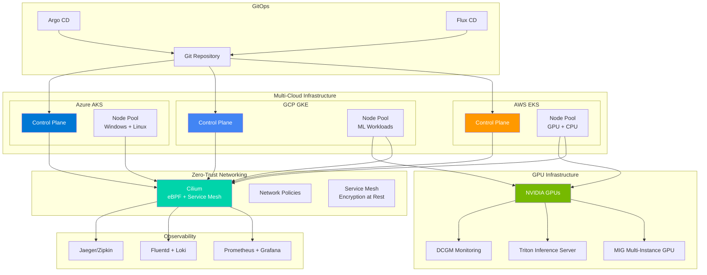

# Kubernetes Demos & Patterns

Production-ready Kubernetes deployments, patterns, and deep dives into container orchestration.

## 📋 Overview

This directory contains comprehensive demonstrations of Kubernetes concepts, production deployment patterns, and operational best practices developed across **100+ real-world deployments** across AWS, GCP, and Azure.

### What You'll Find Here

| Category | Description | Files |
|----------|-------------|--------|
| **Core Concepts** | Deep dives into Kubernetes fundamentals | [Why_Kubernetes.md](Why_Kubernetes.md), [Why_Containers.md](Why_Containers.md), [How_pod_gets_deployed.md](How_pod_gets_deployed.md) |
| **Advanced Topics** | Multi-cluster, determinism, debugging | [MultiCluster.md](MultiCluster.md), [Deterministic_builds.md](Deterministic_builds.md), [Debugging_Kubernetes.md](Debugging_Kubernetes.md) |
| **Controllers** | Custom controllers and automation | [Controllers.md](Controllers.md) |
| **Container Internals** | Building from scratch, image inspection | [ContainerFromScratch.md](ContainerFromScratch.md), [Inspect_images.md](Inspect_images.md) |
| **Operations** | etcd internals, troubleshooting | [Inspect_etcd.md](Inspect_etcd.md) |
| **Future Vision** | Strategic roadmap and wishlist | [Ultimate_Kubernetes_Wishlist_2024.md](Ultimate_Kubernetes_Wishlist_2024.md) |

---

## 🚀 Quick Start

### Understanding the Basics

Start here to build foundational knowledge:

1. **[Why Containers?](Why_Containers.md)** - Understanding containerization principles
2. **[Why Kubernetes?](Why_Kubernetes.md)** - Kubernetes philosophy and core concepts
3. **[How Does a Pod Get Deployed?](How_pod_gets_deployed.md)** - The deployment lifecycle

### Advanced Patterns

Once comfortable with basics, explore advanced topics:

- **[Multi-Cluster Architectures](MultiCluster.md)** - Managing multiple Kubernetes clusters
- **[Deterministic Builds](Deterministic_builds.md)** - Reproducible container builds
- **[Building Containers from Scratch](ContainerFromScratch.md)** - Understanding container internals

### Operational Excellence

Production-focused content:

- **[Debugging Kubernetes](Debugging_Kubernetes.md)** - Common issues and solutions
- **[Inspecting etcd](Inspect_etcd.md)** - Understanding Kubernetes' data store
- **[Custom Controllers](Controllers.md)** - Extending Kubernetes functionality

---

## 🏗️ Architecture Patterns

### Production Kubernetes Architecture



### Multi-Cloud Deployment Strategies

Demonstrated approaches for deploying across AWS, GCP, and Azure:

| Cloud | Platform | Use Case |
|-------|----------|----------|
| AWS | EKS | Enterprise applications, deep AWS integration |
| GCP | GKE | Machine learning workloads, managed services |
| Azure | AKS | Windows workloads, enterprise security |

### Zero-Trust Networking

Implementation of Cilium with eBPF for:
- Network policies
- Service mesh functionality
- Deep observability

### GPU-Enabled Clusters

NVIDIA GPU integration patterns:
- MIG (Multi-Instance GPU) for cost optimization
- Triton Inference Server for model serving
- DCGM monitoring integration

---

## 📚 Key Concepts Explained

### Declarative Management

Kubernetes operates on the principle of **desired state**. You define what you want, and Kubernetes works to achieve and maintain that state.

**Example:**
```yaml
apiVersion: apps/v1
kind: Deployment
metadata:
  name: nginx
spec:
  replicas: 3  # Desired state: 3 replicas
  template:
    spec:
      containers:
      - name: nginx
        image: nginx:latest
```

### The Control Plane

The Kubernetes control plane consists of:

| Component | Responsibility |
|-----------|---------------|
| **API Server** | Frontend REST API, authentication, authorization |
| **Scheduler** | Assigns pods to nodes based on resources/affinity |
| **Controller Manager** | Maintains desired state (replica sets, services) |
| **etcd** | Distributed key-value store for cluster state |

### The Node Components

Each node runs:

| Component | Responsibility |
|-----------|---------------|
| **Kubelet** | Manages pod lifecycle, communicates with API server |
| **Kube-proxy** | Handles network routing, load balancing |
| **Container Runtime** | Runs containers (containerd, CRI-O) |

---

## 🔧 Technologies Demonstrated

### Core Kubernetes
- **Talos** - Immutable, minimal Kubernetes OS
- **EKS** (AWS), **GKE** (GCP), **AKS** (Azure)
- **Cilium** - eBPF-based networking and security
- **vCluster** - Virtual Kubernetes clusters

### Infrastructure as Code
- **Pulumi** (Go) - Infrastructure as code in general-purpose languages
- **Terraform** - Declarative infrastructure provisioning

### CI/CD
- **Dagger** - Programmable deployment pipelines
- **Tekton** - Cloud-native CI/CD framework
- **GitHub Actions** - Automated workflows

---

## 🎯 Use Cases

### When to Use Kubernetes

✅ **Ideal for:**
- Microservices architecture
- Need for auto-scaling
- Multi-cloud or hybrid deployment
- Complex networking requirements
- Stateful applications with orchestration needs
- GPU-accelerated workloads

❌ **Not ideal for:**
- Simple single-container applications
- Applications with high deployment complexity needs
- Resource-constrained environments
- Rapid prototyping without scaling needs

---

## 📊 Performance Considerations

### Resource Optimization

- **Pod Anti-Affinity**: Spread pods across failure domains
- **Resource Limits & Requests**: Prevent resource contention
- **Horizontal Pod Autoscaling**: Scale based on CPU/memory/custom metrics
- **Cluster Autoscaling**: Adjust node count based on demand

### Cost Optimization

- **Node Pools**: Mix spot and on-demand instances
- **MIG GPUs**: Partition GPUs for multiple workloads
- **Resource Quotas**: Control per-namespace spending
- **Pod Priority**: Preempt low-priority workloads for critical ones

---

## 🔍 Debugging & Troubleshooting

### Common Issues

| Issue | Symptoms | Solution |
|-------|----------|----------|
| **CrashLoopBackOff** | Pod repeatedly crashes | Check logs, resource limits, container images |
| **ImagePullBackOff** | Can't pull container image | Verify image name, credentials, registry access |
| **Pending** | Pod stuck in pending state | Insufficient resources, scheduling constraints, taints |
| **OOMKilled** | Container out of memory | Increase memory limit, optimize application |

### Tools & Commands

```bash
# Check pod status
kubectl get pods -o wide

# View pod logs
kubectl logs <pod-name>

# Debug pod with shell
kubectl debug -it <pod-name> --image=busybox

# Describe pod for events
kubectl describe pod <pod-name>

# Check node resources
kubectl top nodes

# View cluster events
kubectl get events --sort-by='.lastTimestamp'
```

---

## 🎓 Learning Path

### Beginner
1. Read [Why_Containers.md](Why_Containers.md)
2. Read [Why_Kubernetes.md](Why_Kubernetes.md)
3. Read [How_pod_gets_deployed.md](How_pod_gets_deployed.md)
4. Practice with basic pod and deployment manifests

### Intermediate
5. Read [MultiCluster.md](MultiCluster.md)
6. Read [Debugging_Kubernetes.md](Debugging_Kubernetes.md)
7. Study [Deterministic_builds.md](Deterministic_builds.md)
8. Implement services and ingress controllers

### Advanced
9. Read [Controllers.md](Controllers.md) and write a custom controller
10. Deep dive into [Inspect_etcd.md](Inspect_etcd.md)
11. Build production deployment patterns
12. Explore [Ultimate_Kubernetes_Wishlist_2024.md](Ultimate_Kubernetes_Wishlist_2024.md)

---

## 🔗 External Resources

### Official Documentation
- [Kubernetes.io](https://kubernetes.io/docs/) - Official documentation
- [Talos Linux](https://www.talos.dev/docs/) - Best-in-class Kubernetes OS
- [Cilium](https://docs.cilium.io/) - eBPF-based networking

### Community & Learning
- [CNCF Landscape](https://landscape.cncf.io/) - Cloud Native ecosystem
- [Kubernetes Blog](https://kubernetes.io/blog/) - Latest announcements

---

## 🤝 Contributing

Have ideas for new patterns or improvements? Please open an issue or PR following our [contributing guidelines](../../CONTRIBUTING.md).

---

## 📄 License

All demos and documentation in this directory are licensed under the MIT License. See [LICENSE](../../LICENSE) for details.

---

**Built with ❤️ for production Kubernetes deployments across 100+ real-world scenarios.**
