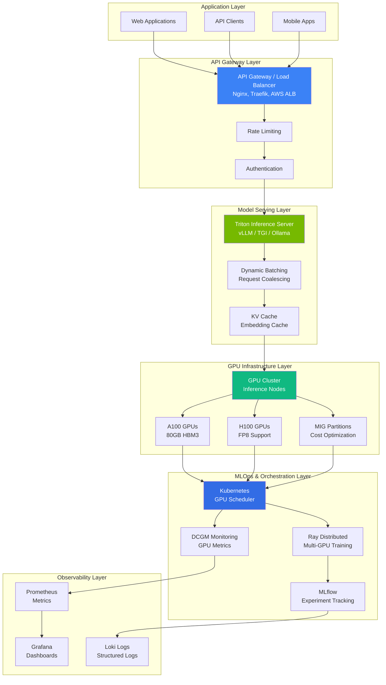
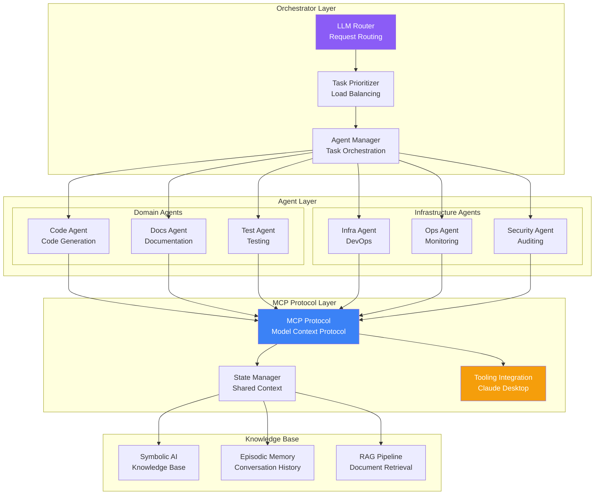

# LLM & AI Infrastructure Demos

Production-grade Large Language Model deployments, AI/ML infrastructure, and MLOps pipelines with deep NVIDIA expertise.

## 📋 Overview

This directory contains comprehensive demonstrations of AI/ML infrastructure, LLM deployment patterns, and MLOps best practices. Focus areas include **NVIDIA GPU optimization**, **multi-agent AI systems**, and **production LLM operations**.

### What You'll Find Here

| Category | Description | Files |
|----------|-------------|--------|
| **Getting Started** | LLM fundamentals and deployment basics | [LLM_Getting_Started.md](LLM_Getting_Started.md), [Make_Your_Own_LLM.md](Make_Your_Own_LLM.md) |
| **NVIDIA Technologies** | Deep GPU optimization and tooling | [Nvidia_software.md](Nvidia_software.md), [Nvidia_cuda_optimization.md](Nvidia_cuda_optimization.md) |
| **Infrastructure & MLOps** | Production AI infrastructure pipelines | [MLOPS.md](MLOPS.md), [Mlflow.md](Mlflow.md), [Ray.md](Ray.md) |
| **Enterprise Solutions** | Vertex AI and production platforms | [Vertex.md](Vertex.md) |
| **Advanced Topics** | Inference optimization and scaling | [Inference.md](Inference.md) |
| **Future Vision** | Strategic roadmap and wishlist | [Ultimate_AI_Infrastructure_Wishlist_2024.md](Ultimate_AI_Infrastructure_Wishlist_2024.md) |

---

## 🚀 Quick Start

### Understanding LLM Fundamentals

Start here to build foundational knowledge:

1. **[LLM Getting Started](LLM_Getting_Started.md)** - LLM basics and deployment concepts
2. **[Make Your Own LLM](Make_Your_Own_LLM.md)** - Training and fine-tuning fundamentals
3. **[NVIDIA Software Stack](Nvidia_software.md)** - GPU optimization fundamentals

### Production Infrastructure

Once comfortable with basics, explore production deployment:

- **[MLOps Pipeline](MLOPS.md)** - Production ML lifecycle management
- **[MLflow](Mlflow.md)** - Experiment tracking and model registry
- **[Ray](Ray.md)** - Distributed computing and scaling
- **[Vertex AI](Vertex.md)** - Enterprise AI platform

### Advanced Optimization

Production-focused optimization:

- **[NVIDIA CUDA Optimization](Nvidia_cuda_optimization.md)** - GPU kernel tuning
- **[Inference Optimization](Inference.md)** - TensorRT and model serving
- **[AI Infrastructure Wishlist](Ultimate_AI_Infrastructure_Wishlist_2024.md)** - Future directions

---

## 🏗️ Architecture Patterns

### LLM Serving Stack

### Multi-Agent AI Systems

---

## 💡 NVIDIA Technologies

### CUDA Optimization

**Key Areas:**
- **Kernel tuning** - Optimize CUDA kernels for specific workloads
- **Memory management** - Efficient GPU memory allocation
- **Batching strategies** - Optimize inference throughput
- **Multi-GPU scaling** - Model parallelism and data parallelism

### MIG (Multi-Instance GPU)

Partition single GPU into multiple instances for:
- **Cost optimization** - Run multiple smaller models on one GPU
- **Isolation** - Separate workloads with dedicated GPU slices
- **Efficiency** - Better utilization for varied workload sizes

### Triton Inference Server

Production-grade model serving:
- **Multiple model formats** - TensorFlow, PyTorch, ONNX, TensorRT
- **Dynamic batching** - Group requests for better GPU utilization
- **Model ensemble** - Serve multiple models together
- **Version management** - A/B testing and rolling updates

### DCGM (Data Center GPU Manager)

Comprehensive GPU monitoring:
- **Real-time metrics** - Utilization, memory, temperature
- **Alerting** - Proactive issue detection
- **Profiling** - Performance optimization insights

---

## 📚 Key Concepts Explained

### Model Serving Strategies

| Strategy | When to Use | Pros | Cons |
|----------|-------------|------|------|
| **REST API** | General applications | Simple, universal | Latency, stateless |
| **gRPC** | Microservices | Faster, bidirectional | More complex setup |
| **WebSocket** | Streaming responses | Real-time updates | Connection overhead |
| **Streaming API** | LLM generation tokens | Low latency per token | More complex client code |

### Inference Optimization

**1. Quantization**
- Reduce precision (FP32 → FP16 → INT8)
- Trade accuracy for speed
- Post-training quantization (PTQ) vs Quantization-aware training (QAT)

**2. Pruning**
- Remove less important weights
- Sparse models with structured pruning
- Retrain for accuracy recovery

**3. Knowledge Distillation**
- Train smaller model to mimic larger model
- Transfer knowledge efficiently
- Maintain accuracy with smaller footprint

**4. Caching & Memoization**
- Cache common embeddings
- Reuse intermediate computations
- KV cache for autoregressive generation

---

## 🔧 Technologies Demonstrated

### Model Serving
- **Triton Inference Server** - Production model serving
- **vLLM** - High-throughput LLM serving
- **Text Generation Inference (TGI)** - HuggingFace's optimized server

### Orchestration
- **Kubernetes** - Container orchestration with GPU support
- **Ray** - Distributed computing framework
- **Kubeflow** - Kubernetes-native ML platform

### Experiment Tracking
- **MLflow** - Experiment tracking and model registry
- **Weights & Biases** - MLOps platform
- **Vertex AI Experiments** - Google Cloud ML platform

### GPU Management
- **NVIDIA CUDA** - GPU programming framework
- **NVIDIA Triton** - Model serving and optimization
- **NVIDIA DCGM** - GPU monitoring
- **NVIDIA MIG** - GPU partitioning

---

## 🎯 Use Cases

### When to Use These Patterns

✅ **Ideal for:**
- Production LLM deployments at scale
- Multi-model serving scenarios
- GPU-accelerated ML pipelines
- Real-time inference workloads
- Cost-optimized GPU utilization
- Multi-agent AI systems

❌ **Not ideal for:**
- Simple API integrations without scaling needs
- Prototyping without GPU resources
- Batch-only workloads (use GPU instances directly)

---

## 📊 Performance Considerations

### GPU Optimization

**Throughput Optimization:**
- Batch size tuning
- Dynamic batching strategies
- Mixed precision training/inference (FP16/BF16)
- Tensor cores utilization

**Latency Optimization:**
- Model quantization (INT8)
- Cache embeddings and attention states
- Stream responses (token-by-token)
- GPU scheduling optimization

**Cost Optimization:**
- MIG GPU partitioning
- Spot/preemptible instances
- Model serving consolidation
- Right-sizing GPU resources

### Scaling Strategies

| Scale | Strategy | GPU Configuration |
|-------|----------|-------------------|
| **Small** (1-10 users) | Single GPU with MIG | 1x L40 (2-4 instances) |
| **Medium** (10-100 users) | Small GPU cluster | 2-4x A100/H100 |
| **Large** (100-1000+ users) | Multi-region cluster | 8-16x A100/H100 with load balancing |

---

## 🔍 Common Issues & Solutions

### GPU Memory Issues

| Issue | Symptoms | Solution |
|-------|----------|----------|
| **CUDA OOM** | Out of memory error | Reduce batch size, use MIG, enable gradient checkpointing |
| **Low GPU Utilization** | GPU not fully used | Increase batch size, optimize data pipeline |
| **Slow Inference** | High latency | Enable quantization, use TensorRT, optimize kernels |

### Model Serving Issues

| Issue | Symptoms | Solution |
|-------|----------|----------|
| **High Latency** | Slow response times | Enable batching, optimize model serving, use faster hardware |
| **Poor Throughput** | Low requests per second | Increase batch size, add more GPUs, optimize inference code |
| **Model Loading Failures** | Models fail to load | Check CUDA compatibility, verify model format, allocate sufficient memory |

---

## 🎓 Learning Path

### Beginner
1. Read [LLM_Getting_Started.md](LLM_Getting_Started.md)
2. Read [Make_Your_Own_LLM.md](Make_Your_Own_LLM.md)
3. Understand [Nvidia_software.md](Nvidia_software.md)
4. Practice with basic model inference

### Intermediate
5. Study [MLOPS.md](MLOPS.md) and implement basic MLflow tracking
6. Learn [Inference.md](Inference.md) optimization techniques
7. Deploy a simple model with Triton
8. Understand GPU monitoring with DCGM

### Advanced
9. Deep dive into [Nvidia_cuda_optimization.md](Nvidia_cuda_optimization.md)
10. Implement distributed training with [Ray.md](Ray.md)
11. Build production MLOps pipeline with [Mlflow.md](Mlflow.md)
12. Explore [Ultimate_AI_Infrastructure_Wishlist_2024.md](Ultimate_AI_Infrastructure_Wishlist_2024.md)

---

## 🔗 External Resources

### Official Documentation
- [NVIDIA CUDA Documentation](https://docs.nvidia.com/cuda/) - CUDA programming guide
- [NVIDIA Triton](https://developer.nvidia.com/triton-inference-server) - Model serving
- [HuggingFace Transformers](https://huggingface.co/docs/transformers/) - Model libraries
- [vLLM](https://docs.vllm.ai/) - High-throughput LLM serving

### Research & Learning
- [Papers With Code](https://paperswithcode.com/) - ML research and implementations
- [The LLM Book](https://llmbook.github.io/) - Comprehensive LLM guide

---

## 🤝 Contributing

Have ideas for new patterns or improvements? Please open an issue or PR following our [contributing guidelines](../../CONTRIBUTING.md).

---

## 📄 License

All demos and documentation in this directory are licensed under MIT License. See [LICENSE](../../LICENSE) for details.

---

**Built with ❤️ for production AI/ML infrastructure with deep NVIDIA expertise.**
